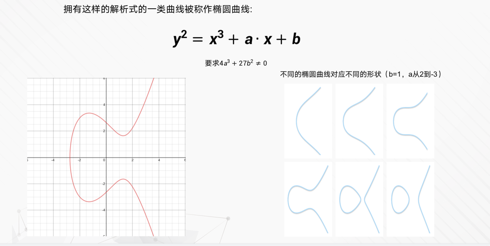
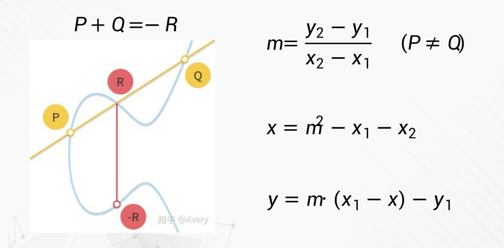
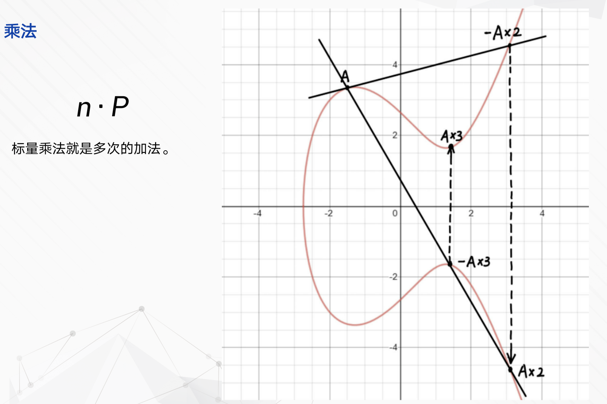
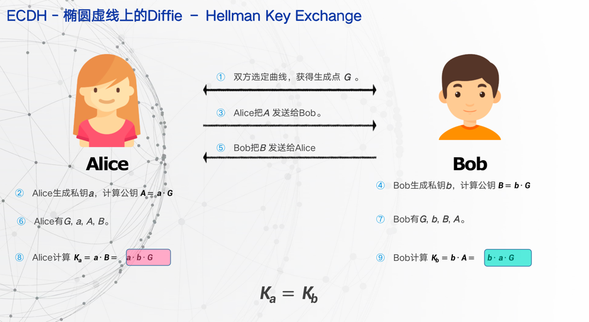
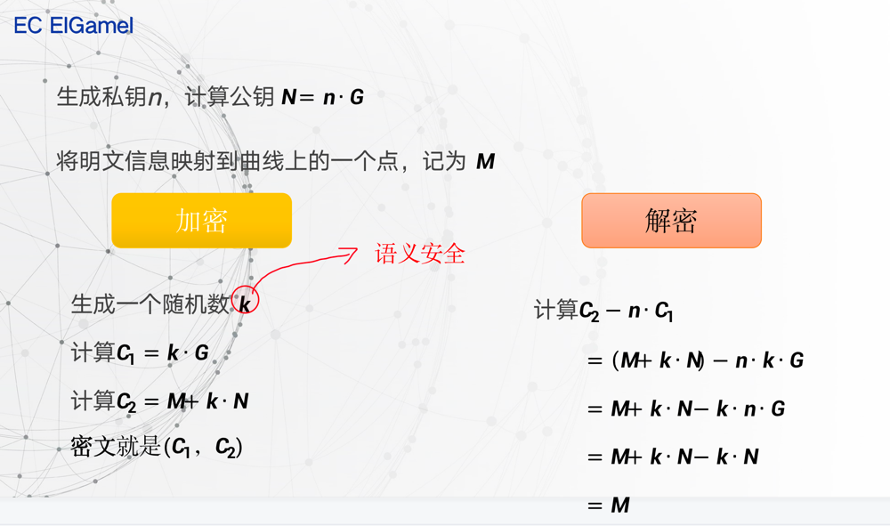
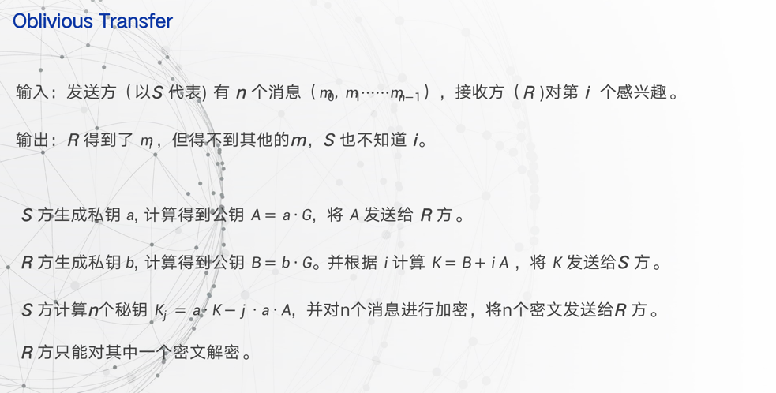

# 椭圆曲线

## 1 什么是椭圆曲线

### 1.1 椭圆曲线加法



### 1.2 椭圆曲线加法



### 1.3 椭圆曲线乘法



### 1.4 椭圆曲线公私钥

N = n * P 知道n和P计算N很容易

给定N和P计算n很困难

n是私钥，N是公钥

私钥是随机生成的一个大整数n，P是曲线上的基点不会变化(t0,t1)，N是作为公钥是一个点(x,y)

## 2. 椭圆曲线上的密钥交换

```text

密钥交换(Diffie Hellman key exchange):
Q = k*P

Q1 = k1 * P
Q2 = k2 * P

C1 = k1 * Q2 = k1 * k2 * P
C2 = k2 * Q1 = k2 * k1 * P

C1 == C2
```



## 3. 椭圆曲线上的加密解密

选⼀条椭圆曲线Ep(a,b), 并取椭圆曲线上⼀点作为基点P。 选定⼀个⼤数k作为私钥，并⽣成公钥Q=kP

加密：选择随机数r，将消息M⽣成密⽂C。密⽂是⼀个点对，即C={C1=rP, C2=M+rQ}

解密：M = C2-k*C1 = M+rQ-k(rP) = M+r(kP)-k(rp) = M



## 4. 椭圆曲线上的不经意传输



## 5. 实现注意细节

### 5.1 取模操作

python 负数取模 结果一直会为正数： truncate除法 -17 % 10 的计算结果如下：r = (-17) - (-17 / 10) x 10 = (-17) - (-2 x 10) = 3

C++ 负数取模 结果一直可正可负： floor除法 -17 % 10 的计算结果如下：r = (-17) - (-17 / 10) x 10 = (-17) - (-1 x 10) = -7

### 5.2 分数取模(逆元)

1. 扩展欧几里得算法
2. 费马定理小定理/欧拉定理
3. 递推法